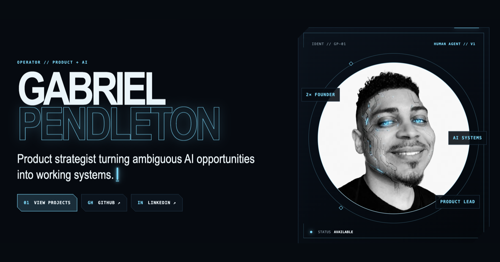

# Gabriel Pendleton — Portfolio

The personal portfolio of Gabriel Pendleton, a Senior Product Leader focused on AI-native products, platforms, and workflows. The site highlights selected product work, writing, credentials, and an approach to building complex systems.

