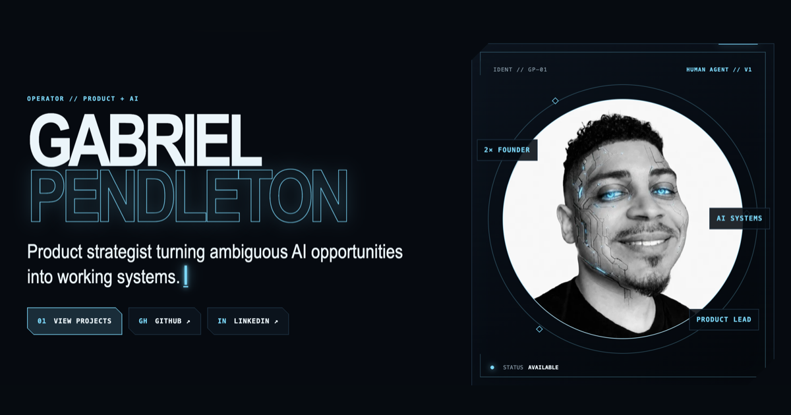

# Gabriel Pendleton — Portfolio

[](https://app.netlify.com/sites/gabrielpendleton/deploys)
[](https://astro.build/)
[](https://www.typescriptlang.org/)
[](https://decapcms.org/)
[](https://nodejs.org/)
[](https://gabrielpendleton.me/)

The personal portfolio of Gabriel Pendleton, a Senior Product Leader focused on AI-native products, platforms, and workflows. Built with Astro and managed through Decap CMS, it brings together selected product work, writing, credentials, and **Ask Gabriel**, an interactive guide to the published portfolio.

[](https://gabrielpendleton.me/)

## What the site includes

- Project case studies and articles managed as Markdown content. Articles support section navigation, short summaries, FAQs, YouTube embeds, and view counts; projects also support video embeds.
- Decap CMS for editing and ordering projects and articles at [the admin page](https://gabrielpendleton.me/admin/).
- Ask Gabriel for typed questions about Gabriel's published work, with grounded answers and clickable source links.
- **Talk to Gabriel** for browser speech input and server-generated voice replies. The same grounded answer powers text and voice; audio streams as it arrives, and visitors can interrupt or stop playback.

## How Ask Gabriel works

Ask Gabriel retrieves relevant material from the portfolio, writing, resume, and approved public GitHub repositories. A single answer-generation step uses that material as evidence and returns the answer with related source links. Broad answers aim to explain both the purpose of a project and the technical choices that make it distinctive, without treating retrieved text as instructions or inventing unsupported details.

Voice uses the browser's microphone and speech recognition for input, then sends the transcribed question through the **same** Ask Gabriel answer path. A server-side speech endpoint turns the grounded answer into streamed audio; source links stay visible in the text transcript. Microphone access starts only when a visitor opens voice mode. Conversations are session-only, and no recordings or API keys are committed to this repository.

Portfolio knowledge is refreshed with `npm run ingest:portfolio`. Approved public GitHub knowledge is refreshed by a daily scheduled function or manually with `npm run ingest:github`. GitHub discovery uses the `ask-gabriel` topic, while the explicitly approved repositories and exclusion rules are documented in [GitHub knowledge sync](docs/ASK_GABRIEL_GITHUB_V1.md).

## Run locally

Use Node.js 22 or newer.

```sh
npm install
cp .env.example .env
npm run dev
```

The Astro dev server previews the site. To exercise Netlify Functions, including Ask Gabriel and voice, use `netlify dev` with the required server-side values in `.env` or the linked Netlify environment. Never put secret keys in `PUBLIC_` or `VITE_` variables or commit `.env`.

Useful checks and content jobs:

```sh
npm run build
npm run test:voice
node scripts/test-ask-gabriel.mjs
npm run test:github-ingestion
npm run ingest:portfolio
npm run ingest:github
```

The ingestion commands write to the configured knowledge store; run them only when you intend to refresh that data. Publishing a commit to `main` triggers the production Netlify build.

## More detail

- [Content editing and ordering](docs/CMS.md)
- [Ask Gabriel voice setup and test plan](docs/ASK_GABRIEL_VOICE_V1.md)
- [Portfolio ingestion](docs/ASK_GABRIEL_PHASE_5.md)
- [GitHub knowledge sync and source relationships](docs/ASK_GABRIEL_GITHUB_V1.md)
