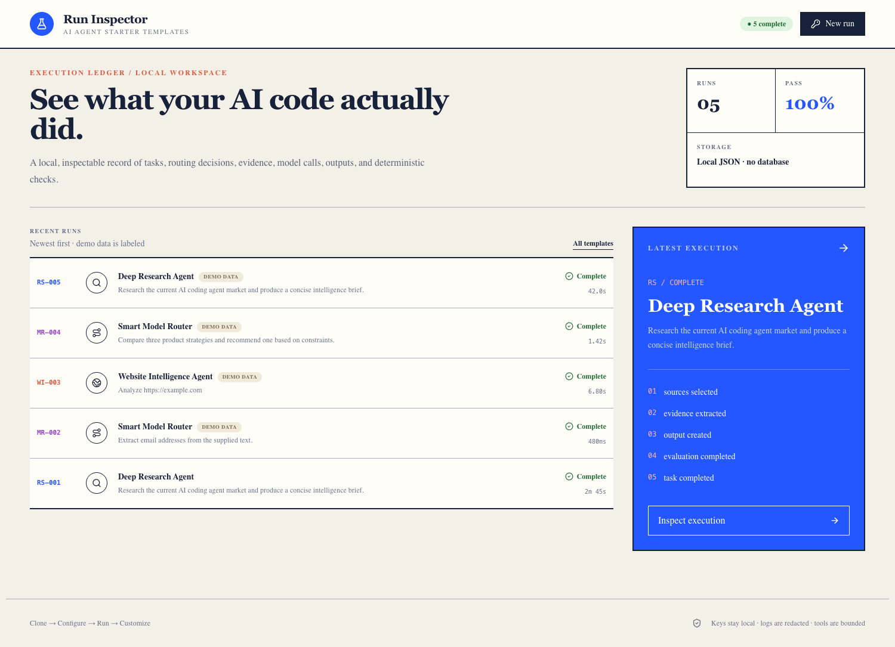
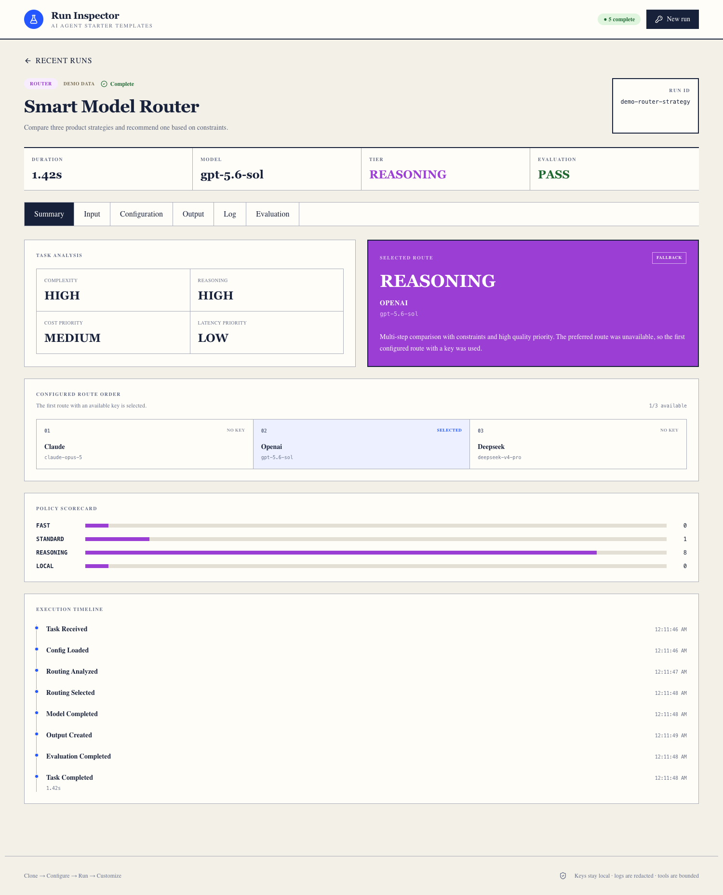

Most AI agent demos are optimized for the moment when something impressive happens.

You give the system a task. It searches, reasons, calls a tool, and produces an answer. The output appears, the demo works, and everyone moves on.

But the most important product questions usually begin after that moment.

Why did the agent choose that model? What evidence did it use? Which configuration shaped the result? What happened when a preferred provider was unavailable? Did the run actually satisfy its requirements, or did it simply produce something that looked convincing?

I built [AI Agent Starter Templates](https://github.com/GabeTHEGeek/ai-agent-starter-templates) to explore those questions through working software.

The project contains three small agent templates: a deep research agent, a smart model router, and a website intelligence agent. Each one can be cloned, configured, run, inspected, and changed without adopting a large framework.

The point is not to offer every possible agent capability. The point is to make the important parts visible.

## I wanted examples that could be understood end to end

Agent systems can become difficult to reason about quickly. A model call becomes a chain. The chain gains tools. Tools create artifacts. Configuration spreads across code and environment variables. Soon, the behavior of the product is distributed across enough layers that even its builder has trouble explaining exactly what happened.

I wanted the opposite experience.

Each template follows one task from input to output. Shared infrastructure handles configuration, provider calls, bounded tools, logging, and evaluation. The workflow itself stays close to the template so a developer can read it from top to bottom.

That constraint shaped the entire project.

The runtime loads configuration, invokes a provider or tool, measures what happened, saves an artifact, and writes a redacted run record. It does not try to become an all-purpose orchestration platform.

Small systems are easier to inspect. They are also easier to question.

## Three templates, three different product problems

The three templates share a runtime, but they are not three skins over the same chat experience. Each one focuses on a different product decision.

### Deep research is an evidence problem

The deep research agent turns a question into a short plan, searches for evidence, selects sources, produces a Markdown brief, and checks whether the result meets a defined contract.

The interesting challenge is not simply getting a model to write a report. It is preserving the path between a claim and the information that supports it.

The output separates findings from inference and keeps source links attached to the work. Deterministic checks verify that required sections and citations exist. Those checks cannot prove universal truth, but they can prevent the system from quietly skipping the structure the product depends on.

### Model routing is a resource-allocation problem

The smart model router evaluates a task and assigns it to a `FAST`, `STANDARD`, `REASONING`, or `LOCAL` tier. It then checks an ordered list of provider and model routes and selects the first one with an available key.

This makes routing visible instead of magical.

The system records the signals it considered, the score for each tier, the providers it checked, the fallback it used, and the reason for the final selection. A missing provider key becomes an explicit event rather than an invisible failure.

That matters because model selection is a product decision. Different work deserves different levels of intelligence, latency, and cost. A system should be able to explain how it allocated those resources.

### Website intelligence is a boundary problem

The website intelligence agent accepts a public URL and a configurable extraction schema. It fetches a small number of safe, same-origin pages and returns only fields supported by evidence.

The useful part is what it refuses to become.

It is not an open-ended crawler. It does not execute arbitrary JavaScript. It blocks local and private destinations, validates redirects, stays on the approved origin, and limits depth, page count, response size, redirects, and request time.

Those boundaries are not implementation trivia. They define the product.

An intelligence system becomes more trustworthy when the user can understand where it looked, what it was allowed to retrieve, and where it stopped.

## The Run Inspector became the center of the project

At first, I thought of the dashboard as a convenient way to view output. It became much more important than that.

Every run creates a structured record containing the input, resolved configuration, model and tool events, output, timing, and evaluation. The local Run Inspector turns that record into something a person can review.

This changed the development loop.

Instead of asking only whether an agent returned a useful answer, I could ask:

- Which provider and model actually ran?
- How long did each stage take?
- What tool calls occurred?
- Was a fallback used?
- What artifact was created?
- Which deterministic checks passed or failed?

Observability is often treated as something added after a product works. With agents, I think it is part of the product itself. If an AI system is making choices on a user’s behalf, those choices should leave a legible trail.

## Provider flexibility should not erase provider differences

The templates support OpenAI, DeepSeek, and Claude through a small common interface. A template can ask a provider to generate a response without spreading provider-specific code throughout the workflow.

That abstraction is useful, but it has limits.

Providers expose different APIs, tools, response formats, and capabilities. The shared interface normalizes the parts the templates need while each adapter handles its provider’s native behavior.

The goal is not to pretend every model is interchangeable. It is to keep the workflow stable while making model choice configurable.

That separation also makes experimentation easier. A developer can change the routing policy or provider order without rewriting the agent’s core job.

## Safety works better when it is concrete

The project keeps API keys in local environment variables or accepts them temporarily for a single dashboard run. Transient keys are passed only to a loopback runner and are not written into saved records, outputs, or screenshots.

Logs are redacted. Website access is bounded. Tests use a deterministic mock provider and require no paid API calls. Seeded examples are labeled as demo data so they cannot be mistaken for live measurements or fresh research.

None of these decisions is especially dramatic. Together, they make the system easier to trust and safer to modify.

I keep returning to the same lesson: reliability usually comes from explicit boundaries, not a longer prompt.

## What I would build from here

These templates are intentionally starting points.

The research workflow could gain domain-specific evaluation. The router could be tuned against real task outcomes and cost data. Website intelligence could support richer schemas while keeping its network boundaries intact. New providers and tools can fit behind the same narrow interfaces.

But I do not want the project to grow by hiding more behavior.

The standard for every addition should be whether a developer can still inspect a run, understand the decision path, and change the system without reverse engineering a framework.

That is the larger idea behind the repository.

An agent should not only do useful work. It should make enough of its work visible that a person can evaluate, improve, and eventually trust it.

You can explore and clone the project on [GitHub](https://github.com/GabeTHEGeek/ai-agent-starter-templates).
